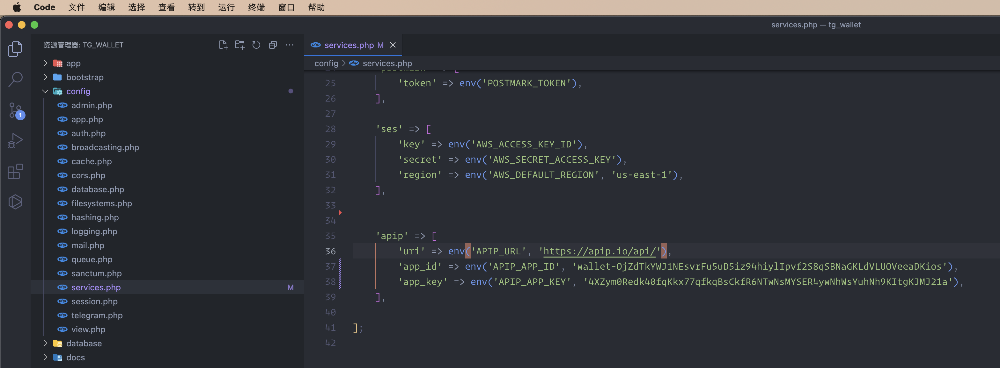

# apip.io payment

BTC ETH USDT/USDC apip.io Payment Gateway

Laravel USDT 数字货币支付接口

[apip.io 官方](https://apip.io/)

#### 使用方法

通过 composer 安装包（注意本包仅适用于 Laravel 框架，其他框架需要仿照修改）

```
composer require apip/wallet
```

然后在 _config/services.php_ 增加配置信息，后可以在.env 定义相关信息：APIP_APP_ID，APIP_APP_KEY

```php
    'apip' => [
        'uri' => env('APIP_URL', 'https://apip.io/api/'),
        'app_id' => env('APIP_APP_ID', 'wallet-OjZdTkYWJ1NEsvrFu5uD5iz94hiylIpvf2S8qSBNaGKLdVLUOVeeaDKios'),
        'app_key' => env('APIP_APP_KEY', '4XZym0Redk40fqKkx77qfkqBsCkfR6NTwNsMYSER4ywNhWsYuhNh9KItgKJMJ21a'),
    ],
```

如图：



然后在 ***.env*** 添加设置 APIP_APP_ID、APIP_APP_KEY

#### 接口方法

```php

# 初始化
$apip = new Apip();

# 创建钱包
$apip->create('test_label')

# 创建指定协议
$apip->create('test_label', 'erc20')
$apip->create('test_label', 'bsc20_usdt')

# 提现 使用热钱包
$apip->create('1.00', '0x0000towallet', 'bsc20_usdt')

# 指定钱包
$apip->create('1.00', '0x0000towallet', 'bsc20_usdt', '0x000from_wallet')


```
